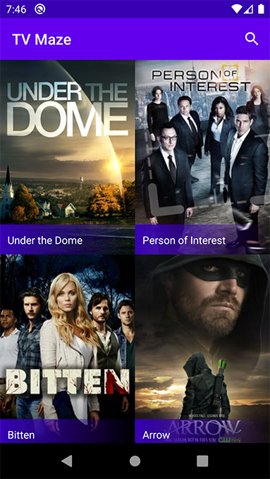
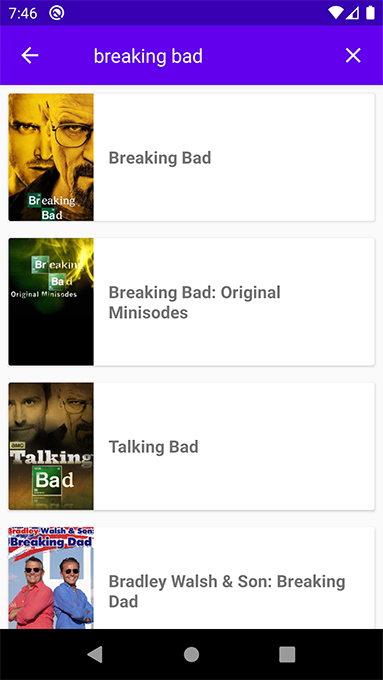
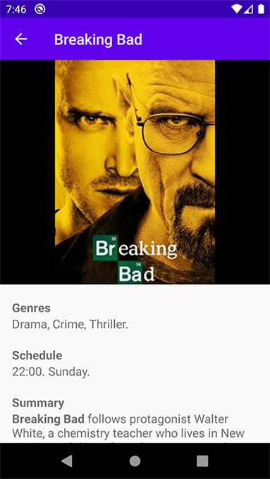

# TV Maze App

API: https://www.tvmaze.com/api

DEBUG APK: ./distribution/app-debug.apk

DONE:
 - List all series contained in the API paginating results. Also implemented local caching of these results in SQLite.
 - Allow users to search series by name.
 - Listing and search views show the name and poster image of the series.
 - After clicking on a series, the application shows the details of the series: name, poster, days and time it airs, genres, summary.

  

As in any project I saw this challenge as an opportunity to learn and use some technologies I've never had the chance to use.
I'm using Flow instead of RxKotlin; view binding instead of data binding or findViewById.
Tried the paging library but I then realized I would not have the time to learn and implement it properly.
Started the project implementing feature modularization (as shown here: https://youtu.be/PZBg5DIzNww?t=292) aiming to provide screens on demand but also realized it could be too complicated to learn and implement in just a couple days.

TODOS:
 - Show episodes in the details page.
 - Show episodes informations.
 - Unit tests.
 - Use D.I. library.
 - Search first in the local database.
 - Save tv series details data into the local database.
